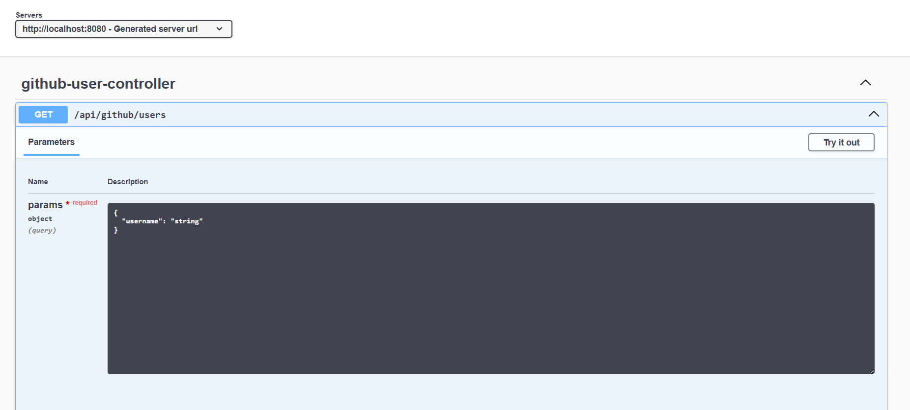

# github-api-service
This application integrates with GitHub's REST API to retrieve user and repository information.

# Table of Contents
1. [Technologies](#technologies)
2. [Configuration](#configuration)
3. [Build The Application](#build-the-application)
4. [Run the Application](#run-the-application)
5. [Decisions](#decisions)
6. [Architecture](#architecture)
7. [GitHub REST API Integration](#github-rest-api-integration)
8. [Input Sanitization](#input-sanitization)
9. [Exception Handling](#exception-handling)
10. [Caching the Response](#caching-the-response)

# Technologies
* Java 21
* Spring boot
* Caffeine

# Configuration
This application has the following configuration required properties
* GitHub API Properties
  ```properties
   # The GitHub api url for fetching the user
   github-api-url=https://api.github.com
   # The GitHub user agent that will appear in the User-Agent header on each request
   github-user-agent=row49382-github-api-service
  ```

# Build the Application
To build the application, run the following maven command
```shell
$ mvn clean install
```

# Run the Application
After building the project, run the application jar by running the following command
where `{version}` is the `version` property in the `pom.xml` file.
```shell
$ java -jar /target/github-api-service-{version}.jar
```

Now that the application is running, the application can be tested by navigating to the swagger url: http://localhost:8080/swagger-ui/index.html



# Decisions
This section will contain all major design decisions made during the development process.

## Architecture
The overall architecture of the application was established by grouping like classes together in different folders.
They are broken down as follows:
  * <b>config</b>: Contains all Spring configuration classes.
  * <b>controller</b>: Contains all REST Controller classes.
  * <b>domain</b>: Contains all domain level classes. For this project, this contains the third party integration dtos and the controller dtos.
  * <b>exception</b>: Contains all custom exceptions. All third party exceptions are generally wrapped into domain controlled exceptions that are thrown and handled appropriately.
  * <b>mapper</b>: Contains all classes that map one object to another. In this application, this is how github API responses are mapped to controller dto responses.
  * <b>service</b>: Contains all service classes.
  * <b>validation</b>: Contains all validation classes responsible for cleansing input received from the controller request objects.

## GitHub REST API Integration

When integrating with the GitHub REST api, the following documentation was studied: https://docs.github.com/en/rest/guides/getting-started-with-the-rest-api. 

After reviewing the documentation, it is advised to provide a `User-Agent` header that contains a value representing the application, an `Accept` header that is set to `application/vnd.github+json`, and a `X-GitHub-Api-Version` header to set the api version. 
All were applied in the HttpClient implementation. 

The two endpoints needed to join the appropriate response came from: https://api.github.com/users/{username} and https://api.github.com/users/{username}/repos. 
It was considered if fetching both asynchronously and resolving in a fork join would be the more optimal solution. Without specific requirements, I advised against the pre-optimization and chose a synchronous approach.

## Input Sanitization
The only input provided to the API is the username field. A custom validation was built using jakarka validation interfaces that follows github's guidelines for their usernames:

> Username may only contain alphanumeric characters or single hyphens, and cannot begin or end with a hyphen.
> 
> Then through a little exploration: A username cannot be blank. A username must less than or equal to 39 characters.

The validator utilized a regex pattern that matched this criteria so no invalid usernames are sent to the service. Any validation error will appear back to the client with a status code 400.

## Exception Handling
All third party exceptions are wrapped and thrown into one of this service domain specific exceptions. 
Those exceptions are caught by the GlobalExceptionHandler which wrap the exception message into the ErrorResponse which
contains the http status code and the exception message.

## Caching the Response
Because of the rate limitation, a caching mechanism made sense to implement. Caffeine was chosen because it works well for simple key value caching while integrating well with spring cache.
Spring cache has the benefit of having a built-in eviction policy so consumers are able to retrieve updates.


